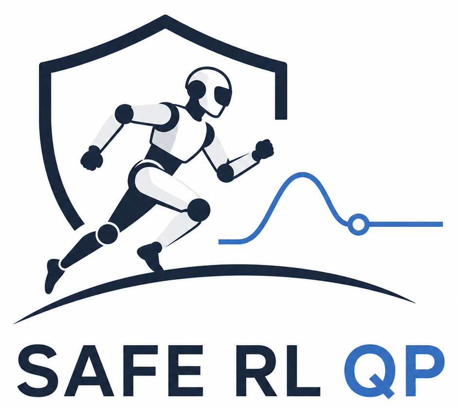

<p align="center">
  <a >
    
  </a>
</p>

---

# mc_rtc RL-QP controller template

This project is a template for a new RL-QP controller project wihtin [mc_rtc].

The goal of this template is to help users deploy reinforcement learning (RL) policies within a Quadratic Programming (QP) framework augmented with Control Barrier Functions (CBFs). This combination is enforcing physical and safety constraints, including:

* Joint position limits
* Joint velocity limits
* Torque limits
* Self-collision avoidance

Further details are available in:

[*Safe Execution of RL Policies via Acceleration-based CBF-QP Constraint Enforcement for Real-World Robotic Deployments*](https://hal.science/hal-05362571)

It comes with:
- a CMake project that can build a controller in [mc_rtc], the project can be put within [mc_rtc] source-tree for easier updates
- clang-format files
- automated GitHub Actions builds on three major platforms

Currently only ONNX format policies are supported.

This template has already been adapted to :
- [H1](https://github.com/Alhuuin/h1_rl_qp_controller)
- [HRP5P](https://github.com/bastien-muraccioli/hrp5p_rl_qp_controller)

If the target robot is already supported, please refer to the corresponding repository above. Otherwise, this template is intended as a starting point to integrate additional robots.

## Documentation

The complete documentation, including the controller architecture, observation system, policy configuration, adaptation guide and API reference, is available at:

**https://alhuuin.github.io/rl-qp-controller.github.io/**

The documentation also includes practical guides for adapting the controller to new robots and examples.

## Template layout

- `policies/minimalExample/`: smallest explicitly configured policy accepted by the current parser.
- `policies/fullExample/`: exhaustive reference for every currently accepted policy and observation fields.
- `policies/conventions.yaml`: placeholder joint groups, training orders, aliases and observation defaults.
- `etc/NewRLQPController.in.yaml`: controller, observer and constraint examples.
- `src/states/NewRLQPController_Initial.cpp`: policy-execution state.
- `src/observation/`: reusable observation implementations.
- `src/policy/`: policy loading, validation, ONNX inference and runtime state.

## Required robot adaptation

The source marks adaptation points with `TODO(robot)`. Search them before attempting to run the controller:

```bash
grep -rn "TODO(robot)"
```

## Deploy your own policy

Policies are stored in `policies`. Each subdirectory describes everything the controller needs to know to load. run and use the policy.
You here have access to 2 example directories. `minimalExample` with a basic, minimal configuration, and `fullExample` to have a better idea of the full potential of the default version of this controller.

1. Create a new subdirectory in `policies`
1. Add the exported model in ONNX format inside
2. set the action and controlled-joint groups, provide training-consistent `kp` and `kd`, and add any required action scaling, default pose, phase period or command parameters in `policy.yaml`
5. reproduce the exact observation order and history in `observations.yaml`.

Set `default_policy` in `etc/NewRLQPController.in.yaml`.

## Build

```bash
mkdir -p build && cd build
cmake .. -DCMAKE_BUILD_TYPE=RelWithDebInfo
cmake --build . -j
sudo cmake --install .
```

Enable your controller in mc_rtc after completing all required adaptation points.

## Control flow summary

```
Every controller timestep (physics_step_size):
├── If syncTime >= policyStepSize:
│   ├── observation = getCurrentObservation()
│   ├── action      = rlPolicy->predict(observation)
│   ├── q_rl        = action * actionScale + q_zero
│   └── syncTime    = 0
│
├── τ = Kp*(q_rl - q) - Kd*q̇
│
├── useQP=true:  τ → TorqueJointTask → CBF-QP → robot
└── useQP=false: τ → robot (direct)
```

[mc_rtc]: https://jrl-umi3218.github.io/mc_rtc/
